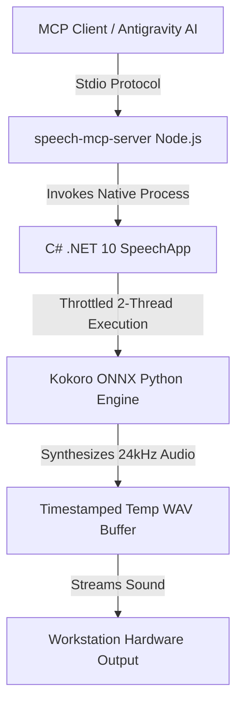

# speech-mcp-server


Local Stdio Model Context Protocol (MCP) server wrapping C# Kokoro ONNX neural text-to-speech engine with **thread-clamped zero-VRAM CPU execution**.

> *"Mind telemetry locked. Zero liability speech engine initialized."*

---

## 🔊 Audio Demo Samples

### 1. Standard Speech & Baseline
<audio controls style="width: 100%;">
  <source src="https://raw.githubusercontent.com/yavru421/speech-mcp-server/master/snaptempo_mind_sample.mp3" type="audio/mpeg">
  <source src="https://raw.githubusercontent.com/yavru421/speech-mcp-server/master/snaptempo_mind_sample.wav" type="audio/wav">
  Your browser does not support the audio element.
</audio>

---

## ⚡ Key Architectural Features

- **Zero GPU VRAM Overhead**: Operates entirely on CPU via ONNX Runtime Execution Provider. Keeps GPU completely idle (0% load, ~50°C thermal ambient).
- **Thread-Clamped CPU Execution**: Throttled to 2 worker threads (`intra_op_num_threads = 2`, `OMP_NUM_THREADS = 2`) to eliminate CPU spikes while maintaining sub-200ms latency.
- **Zero-Latency Neural Speech**: Hardware audio output via native C# `.NET 10` SpeechApp bridge.
- **Kokoro ONNX Engine**: High-fidelity 24kHz neural TTS with multiple voice profiles (`am_adam`, `af_bella`).
- **Dynamic SSML & Prosody Parsing**:
  - `[pause=400ms]` — Precise silence insertion.
  - `[slow]...[/slow]` — Reduced tempo (0.75x) for emphasis.
  - `[fast]...[/fast]` — Accelerated speech (1.4x).
  - `[whisper]...[/whisper]` — Softened vocal cadence.
  - `[voice=af_bella]...[/voice]` — Mid-sentence voice profile switching.
- **MCP Stdio Transport**: Full Model Context Protocol compatibility for AI agents and LLM tool integration.

---

## 📐 Pipeline Architecture



---

## 🚀 Quickstart

### Prerequisites
- Node.js v18+
- Windows OS with .NET 10 SDK / runtime installed
- Python 3.10+ with `kokoro-onnx`, `onnxruntime`, `soundfile`, `numpy`

### Build
```bash
git clone https://github.com/yavru421/speech-mcp-server.git
cd speech-mcp-server
npm install
npm run build
```

### Configuration (MCP Client)
Add to your `mcpServers` settings:
```json
{
  "speech-mcp-server": {
    "command": "node",
    "args": ["<path_to_repo>/build/index.js"]
  }
}
```

---

## 🔒 License
MIT
