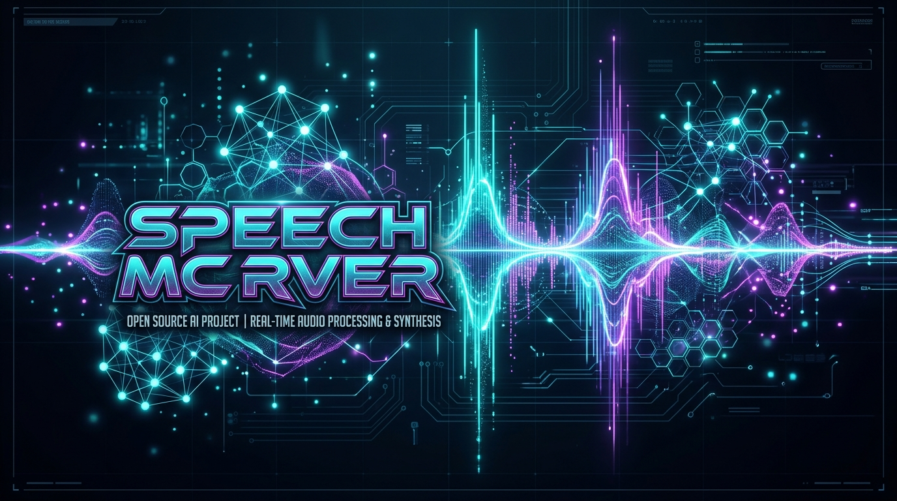

# speech-mcp-server



Local Stdio Model Context Protocol (MCP) server wrapping C# Kokoro ONNX neural text-to-speech engine.

> *"Mind telemetry locked. Zero liability speech engine initialized."*

## Audio Demo Sample

<audio controls src="https://raw.githubusercontent.com/yavru421/speech-mcp-server/master/snaptempo_mind_sample.wav">
  Your browser does not support the audio element.
</audio>

## Features
- **Zero-Latency Neural Speech**: Instant hardware audio output via native C# `.NET 10` SpeechApp.
- **Kokoro ONNX Model**: High-fidelity neural TTS with voice profiles (e.g. `am_adam`).
- **MCP Stdio Transport**: Native integration for AI agents and LLM clients.

## Quickstart

### Prerequisites
- Node.js v18+
- Windows OS with .NET 10 SDK / runtime installed

### Installation & Build
```bash
git clone https://github.com/yavru421/speech-mcp-server.git
cd speech-mcp-server
npm install
npm run build
```

### Configuration (MCP Client)
Add to your `mcpServers` configuration:
```json
{
  "speech-mcp-server": {
    "command": "node",
    "args": ["<path_to_repo>/build/index.js"]
  }
}
```

## License
MIT

